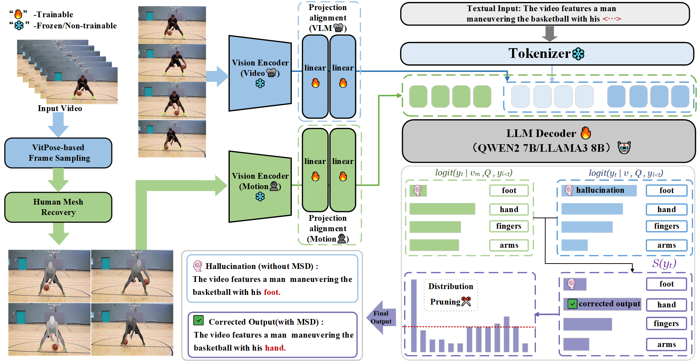
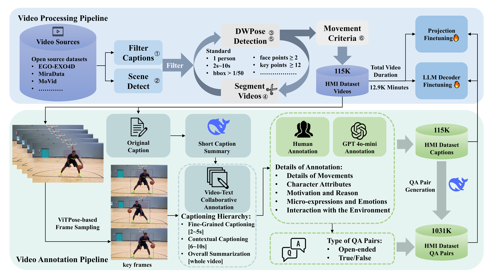
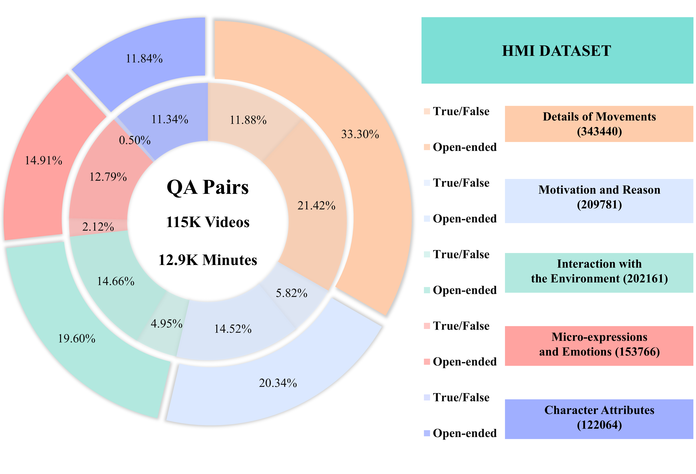
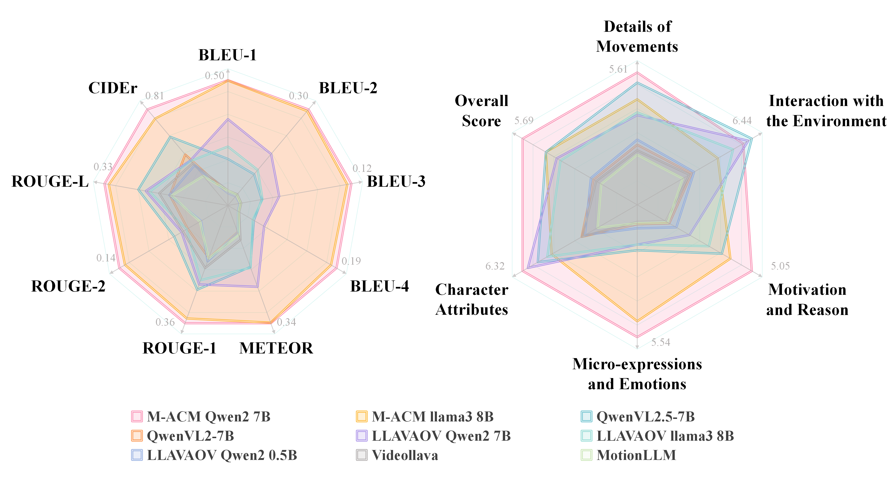

<div align="center">


#  M-ACM: Towards Fine-Grained Human Motion Video Captioning

[]()
[](https://2025.acmmm.org/)
[](https://loststars2002.github.io/M-ACM/)
[](https://creativecommons.org/licenses/by-nc-sa/4.0/)

**[Guorui Song](https://github.com/LostStars2002)¹** · **Guocun Wang¹** · **Zhe Huang¹** · **Jing Lin²**
**Xuefei Zhe³** · **Jian Li¹** · **Haoqian Wang¹**

¹Tsinghua University · ²ByteDance · ³City University of Hong Kong

</div>

---

## 📣 News

* **[2025/07/05]**: 🎉 M-ACM has been **accepted** by ACM MM 2025!
* **[2025/10/25]**: 📄 The paper of M-ACM has been submitted to arXiv.
* **[2025/10/25]**: 🌐 Project page is now online!

## 📋 TODO

- [ ] 🚀 Release training code
- [ ] 🔧 Release inference code
- [ ] 📦 Release pre-trained model weights
- [ ] 📝 Add usage examples and tutorials
- [ ] 🎯 Release evaluation scripts

---

## 💡 Introduction

Generating accurate descriptions of human actions in videos remains a challenging task for video captioning models. Existing approaches often struggle to capture **fine-grained motion details**, resulting in vague or semantically inconsistent captions.

<p align="center">
  
</p>

To address this challenge, we introduce **M-ACM (Motion-Augmented Caption Model)**, a novel dual-pathway framework that:

- 🎯 **Reduces hallucinations** by combining standard visual understanding with specialized motion representations from SMPL-based human mesh recovery
- 🔄 **Motion Synergetic Decoding (MSD)**: Calculates synergy between visual and motion pathways through five complementary components
- 📊 **HMI Dataset**: Provides 115K high-quality video-description pairs with 1031K QA pairs focused on human movement
- 🏆 **HMI-Bench**: Specialized benchmark evaluating motion caption generation across multiple dimensions

---

## 💻 Dataset Information


### 📊 Dataset Quality Assessment
<p align="center">
  
</p>
<details>
<summary><b>Motion Quality Filtering</b></summary>

- ✓ DWPose-based human detection (>90% frames with single person)
- ✓ Keypoint visibility (≥12 keypoints with confidence >0.5)
- ✓ Movement criteria (Euclidean distance tracking across frames)
- ✓ Scene consistency (2-10 second segments after scene detection)

</details>

<details>
<summary><b>ViTPose-based Frame Sampling</b></summary>

- Keypoint-driven sampling for maximum motion representation
- First frame: Maximum average distance to all frames in segment
- Subsequent frames: Maximum distance to previous keyframe
- Ensures diverse and informative frame selection

</details>


### 📦 HMI Dataset Composition

<div align="center">

| Source Dataset | Video Count | Total Duration | Description |
|:--------------|:----------:|:--------------:|:------------|
| LLaVA-Video-178K | 44.2K | 4K min | General video-text pairs |
| Ego-Exo4D | 27.6K | 4K min | First/third-person views |
| MiraData | 21.6K | 2.4K min | Long-duration videos |
| MoVid | 19.6K | 2.2K min | Motion-focused content |
| ShareGPT4Video | 2.1K | 0.3K min | High-quality captions |
| **HMI (Ours)** | **115K** | **12.9K min** | **Human motion focused** |

</div>

### 🎯 QA Pairs Distribution

<p align="center">
  
</p>

The HMI dataset includes **1031K QA pairs** across five dimensions:
- **Details of Movements** (26.10%): Fine-grained action descriptions
- **Interaction with Environment** (20.34%): Human-object/scene interactions  
- **Motivation and Reason** (19.28%): Intent and purpose understanding
- **Micro-expressions and Emotions** (17.42%): Subtle facial/body cues
- **Character Attributes** (16.86%): Physical characteristics and states

### 🏆 HMI-Bench Statistics

- **Total Videos**: ~1.1K carefully curated samples
- **QA Pairs**: 3.3K (2.1K open-ended + 1.2K True/False)
- **Sources**: MotionBench + Ego-Exo4D (non-overlapping with training data)
- **Evaluation**: Multi-dimensional assessment of motion understanding


---

## 📃 Performance Comparison

### 🎯 Standard Caption Metrics on HMI-Bench

<div align="center">

| Model | BLEU-1 | BLEU-4 | METEOR | ROUGE-L | CIDEr |
|:------|:------:|:------:|:------:|:-------:|:-----:|
| MotionLLM | 0.014 | 0.001 | 0.059 | 0.132 | 0.191 |
| VideoLLaVA | 0.015 | 0.002 | 0.075 | 0.168 | 0.308 |
| LLaVA-OV-Qwen2-7B | 0.326 | 0.033 | 0.223 | 0.207 | 0.334 |
| QwenVL2.5-7B | 0.153 | 0.020 | 0.160 | 0.229 | 0.553 |
| **M-ACM Llama3-8B** | **0.493** | **0.117** | **0.336** | **0.315** | **0.722** |
| **M-ACM Qwen2-7B** | **0.495** | **0.124** | **0.338** | **0.327** | **0.807** |

</div>

> 🚀 **M-ACM achieves 3.7× improvement in BLEU-4 and 1.5× improvement in CIDEr** compared to the best baseline!

### 🎨 Human Motion Understanding Dimensions

<div align="center">

| Model | Details of<br>Movements | Interaction with<br>Environment | Motivation<br>and Reason | Micro-expressions<br>and Emotions | Character<br>Attributes | Overall<br>Score |
|:------|:-------:|:-------:|:-------:|:-------:|:-------:|:-------:|
| MotionLLM | 1.40 | 1.67 | 0.98 | 0.30 | 1.77 | 1.40 |
| VideoLLaVA | 1.96 | 2.58 | 0.87 | 0.23 | 2.70 | 1.67 |
| LLaVA-OV-Qwen2-7B | 3.83 | 6.22 | 2.03 | 1.28 | 6.00 | 3.83 |
| QwenVL2.5-7B | 4.42 | 6.44 | 3.60 | 1.54 | 5.40 | 4.42 |
| **M-ACM Llama3-8B** | **4.36** | **4.34** | **4.01** | **4.81** | **4.56** | **4.42** |
| **M-ACM Qwen2-7B** | **5.61** | **5.91** | **5.05** | **5.54** | **6.32** | **5.69** |

</div>

<p align="center">
  
</p>

> 💡 **Significant improvements**: 40% in motivation understanding, 260% in detecting micro-expressions!

### 🔬 Ablation Studies

<div align="center">

| Components | Details of<br>Movements | Interaction with<br>Environment | Motivation<br>and Reason | Micro-expressions<br>and Emotions | Character<br>Attributes | Overall<br>Score |
|:-----------|:-------:|:-------:|:-------:|:-------:|:-------:|:-------:|
| Baseline (LLaVA-OV) | 3.62 | 6.22 | 2.03 | 1.28 | 6.00 | 3.83 |
| + HMI Dataset | 5.20 | 5.81 | 4.73 | 5.22 | 5.61 | 5.31 |
| + MSD | 5.51 | 5.81 | 4.92 | 5.36 | 6.03 | 5.53 |
| + ViTPose Sampling | **5.61** | **5.91** | **5.05** | **5.54** | **6.32** | **5.69** |

</div>

> ✅ Each component contributes significantly: **38.6% from HMI**, **4.1% from MSD**, **2.9% from ViTPose sampling**

---

## 🛠️ Method Overview

<p align="center">
  
</p>

### 🔑 Core Components

1. **Dual-Pathway Architecture**
   - 🎥 **Visual Pathway**: Frozen vision encoder (CLIP/SigLip) → Projection alignment
   - 💃 **Motion Pathway**: ViTPose sampling → Human mesh recovery (SMPL) → Motion encoder


2. **Motion Synergetic Decoding (MSD)**
   ```
   S(yT) = Σ(i=1 to 5) Li(yT)
   
   L1: Amplifies high-confidence predictions (exponential terms)
   L2: Maintains balanced contributions (averaging mechanism)
   L3: Soft penalty for modal disagreements (logarithmic scaling)
   L4: Captures non-linear relationships (power transformation)
   L5: Discourages large discrepancies (quadratic penalties)
   ```

3. **Distribution Pruning**
   ```
   Vhead(yT) = {yt ∈ V | ρ(yt|v,Q,y<t) ≥ β·(1+S(yT))}
   ```

### 📋 Training Details

- **Base Models**: Qwen2-7B (SigLip) / Llama3-8B (CLIP)
- **Hardware**: 8× NVIDIA A100 GPUs
- **Training Time**: ~35 hours per model
- **Data**: 115K captions + 206K QA pairs (20% of total)
- **Hyperparameters**: α=[0.5,0.2,0.4,0.8,0.3,2.0], β=0.2, θ=2.0

---

## 🚀 Coming Soon

We are currently organizing and cleaning up the code for release. The following will be available soon:

- 💻 **Training Code**: Complete training pipeline and scripts
- 🔧 **Inference Code**: Easy-to-use inference interface
- 🎯 **Pre-trained Models**: Model weights for both Qwen2-7B and Llama3-8B variants
- 📚 **Detailed Documentation**: Usage examples and tutorials
- 🧪 **Evaluation Scripts**: Benchmark evaluation tools

Stay tuned! ⭐ **Star this repo** to get notified when the code is released!

---

## 📚 Citation

If you find M-ACM useful for your research, please cite our paper:

```bibtex
@inproceedings{song2025macm,
  title={Towards Fine-Grained Human Motion Video Captioning},
  author={Song, Guorui and Wang, Guocun and Huang, Zhe and Lin, Jing and Zhe, Xuefei and Li, Jian and Wang, Haoqian},
  booktitle={Proceedings of the 33rd ACM International Conference on Multimedia},
  pages={1--10},
  year={2025},
  organization={ACM},
  doi={10.1145/3746027.3754560}
}
```

---

## 🙏 Acknowledgments

We thank the authors of the following datasets for making their data publicly available:
- [LLaVA-Video-178K](https://github.com/LLaVA-VL/LLaVA-Video)
- [Ego-Exo4D](https://ego-exo4d-data.org/)
- [MiraData](https://github.com/mira-space/MiraData)
- [MoVid](https://github.com/OpenMotionLab/MotionLLM)
- [ShareGPT4Video](https://github.com/ShareGPT4Omni/ShareGPT4Video)

---


## 📄 License

This project is licensed under the [Creative Commons Attribution-NonCommercial-ShareAlike 4.0 International License](https://creativecommons.org/licenses/by-nc-sa/4.0/).

<!-- ---

<div align="center">

**[🏠 Project Page](https://loststars2002.github.io/M-ACM/) | [📄 Paper](https://arxiv.org/abs/2508.14879) | [💾 Dataset](https://huggingface.co/datasets/LostStars2002/HMI-Dataset) | [🤗 Models](https://huggingface.co/LostStars2002)** -->

⭐ **If you find this work helpful, please give us a star!** ⭐

</div>

---

## 🌟 Star History

[](https://star-history.com/#LostStars2002/M-ACM&Date)
